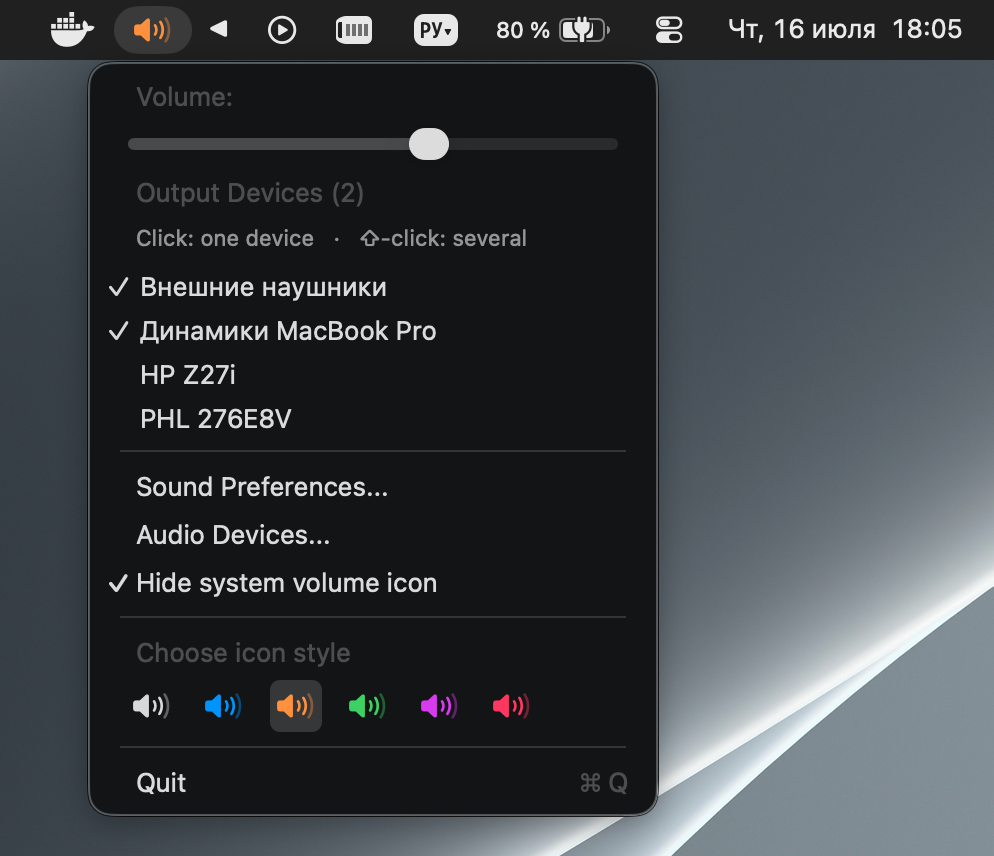

<p align="center">
  
</p>

## MultiSound Changer for macOS — Tahoe / Apple Silicon fork

> **This is a community fork** of [rlxone/MultiSoundChanger](https://github.com/rlxone/MultiSoundChanger),
> which has seen no release since v1.0.1 (April 2021) and neither builds nor works on Apple Silicon
> or macOS Tahoe. It is **not** affiliated with or endorsed by the original author.

A menu-bar app that controls the volume of **aggregate and multi-output devices** — the ones macOS
won't let you adjust, because its built-in volume slider is greyed out for them. It sets the volume of
every sub-device in the aggregate, which is the one thing the system control can't do.

Features:

* **Volume for aggregate / multi-output devices.** The core feature: adjust the volume of every
  device inside an aggregate at once, from a single slider in the menu bar or with the media keys.
* **Send sound to several devices at once — straight from the menu.** Tick the outputs you want and
  the app builds and manages a Multi-Output device for you; no more assembling one by hand in Audio
  MIDI Setup. A plain click switches to a single device, **⇧-click** adds/removes devices from the
  set without closing the menu. A device that gets unplugged stays selected and is picked back up
  when it returns.
* **Switch the default output device** right from the menu.
* **Tell this app's icon apart from the system one.** Optionally hide the system's own volume icon,
  and/or tint this app's icon (Blue / Orange / Green / Purple / Pink) — both are off by default.
* **Media keys** (volume up / down / mute) drive the selected device, aggregate included.
* **Native look** — follows the system light/dark appearance.
* **Universal binary** — runs natively on Apple Silicon and Intel, macOS 11+ including Tahoe.

Handy if you run VoodooHDA with 4.0+ output, among other multi-device setups.

## Tahoe / Apple Silicon support

Three separate things were broken. Here is what each one actually was, and what this fork does about
it.

### 1. It didn't build for Apple Silicon

The project shipped a compiled copy of Apple's private `OSD.framework`, and that binary contained
only an x86_64 slice — hence `EXCLUDED_ARCHS = arm64` in the project settings.

**This fork removes the private framework entirely.** The volume HUD is now drawn by the app itself
(see below), so nothing calls `OSDManager` any more and nothing needs to link against it. The app no
longer depends on any private Apple framework, and builds as a universal binary (arm64 + x86_64).

### 2. The volume HUD stopped appearing

Worth being precise, since the popular explanation is wrong: `OSDManager` **is still present** on
Tahoe, and `showImage:...` still accepts the call without crashing. What no longer happens is the
drawing — `OSDUIHelper`, the XPC service behind it, is never spawned, so the call goes nowhere.
(`OSDUIHelper` itself still exists; it moved out of `OSD.framework/XPCServices/` to
`/System/Library/CoreServices/OSDUIHelper.app`.) Apple provides no public API to draw the system HUD.

**This fork draws its own HUD** — a pill near the top of the screen built on `NSVisualEffectView`, so
it follows light/dark appearance. It is deliberately *not* a replica of the old centred chiclet
square: Tahoe shows volume as a compact popover near Control Center, so the old design would read as
dated rather than native.

### 3. Volume keys were swallowed before the app could see them

macOS handles volume keys at the HID layer, *before* any `CGEventTap` can intercept them. That is why
the useless "volume cannot be changed" HUD kept appearing on aggregate devices.

**This fork remaps the volume keys at the driver level** with `hidutil`, from the consumer usage page
onto F18/F19/F20 — which the system ignores and the app picks up instead.

> This has a **system-wide side effect** while the app runs. See [Known limitations](#known-limitations).

## Usage

### Playing sound on multiple devices at once

Open the menu and use the device list: a plain click switches output to that device; **⇧-click**
(shift-click) toggles it into or out of the current selection without closing the menu, so you can
check several devices in one go. The app creates and manages a single Multi-Output device for you —
there's no need to build one by hand in Audio MIDI Setup any more. At least one device is always
selected; the last checked box can't be unchecked. A device you selected that gets unplugged stays
checked (shown greyed out) and is picked back up automatically once it's back.

### Hiding the system volume icon

This app's menu bar icon sits right next to the system's own volume icon and can be hard to tell
apart from it. Check **"Hide system volume icon"** in the menu to hide the system one while the app
is running — it's restored automatically when you quit. Off by default; the app never touches this
setting unless you turn it on.

### Tinting the menu bar icon

Pick one of the colour swatches in the menu (Blue / Orange / Green / Purple / Pink) to recolour this
app's own icon, as another way to tell it apart from the system one at a glance. Each swatch previews
the actual icon in that colour. "Default" resets it to the normal look. The choice is remembered
across restarts.

The app needs **accessibility permission** to observe media keys, and will ask on first launch.

## Installation

Builds are **ad-hoc signed and not notarized** — there is no Apple Developer ID behind this fork, so
Gatekeeper will refuse to open it on first launch. To get past it:

```sh
xattr -cr /Applications/MultiSoundChanger.app
```

Alternatively, allow it in System Settings → Privacy & Security after the first blocked attempt.

## Known limitations

**Volume key remapping can outlive a crash.** The remapping lives in the system, not in this process.
It is reverted on a normal quit and on `SIGTERM`/`SIGINT`, and re-applied cleanly on the next launch —
but nothing can catch `SIGKILL` or a power loss. If the app dies that way and you don't restart it,
your volume keys stay remapped. Fix it by hand with:

```sh
hidutil property --set '{"UserKeyMapping":[]}'
```

The remapping does not survive a reboot either, so restarting also clears it.

**The managed Multi-Output device can outlive a crash, for the same reason.** It has to be visible
system-wide (`private: 0`) so that other apps' sound can reach it too — which means it also survives
if the process dies unexpectedly, same as the key remapping above. On every launch the app looks for
it by a fixed UID and reuses it instead of creating a duplicate. If you ever remove the app for good
and want to clean up after it, delete the **"MultiSoundChanger2 Output"** device by hand in Audio MIDI
Setup.

**Hiding the system volume icon relies on an undocumented Control Center preference**
(`com.apple.controlcenter Sound`). The app reads, saves and restores whatever value was already there
— it never hardcodes a value to restore — but Apple could rename or remove this key in a future macOS
release, at which point hiding/restoring will simply stop working (logged, not a crash). To revert by
hand:

```sh
defaults -currentHost write com.apple.controlcenter Sound -int 16
killall ControlCenter
```

(`16` is what "Always Show" typically maps to on most Macs — not a guaranteed universal value; if it
doesn't bring the icon back, check Control Center settings directly.)

**Your own key remappings are safe.** `hidutil` replaces the entire `UserKeyMapping` list, so a naive
implementation would wipe remappings you set up yourself (Caps Lock → Escape and friends). This fork
reads the current list, keeps everyone else's entries, and removes only its own on exit.

**macOS 11.0 or later.** Raised from 10.10: the HUD uses SF Symbols (macOS 11+), and 11.0 is also the
earliest macOS running on Apple Silicon.

**Intel builds are compiled but lightly tested.** The universal binary includes an x86_64 slice and it
has been exercised under Rosetta 2 — but not on real Intel hardware.

## Building

Requires **Xcode 26 or later**. Command Line Tools alone are *not* enough: the project uses
storyboards and an asset catalog, which need `ibtool`/`actool`, and those ship only with full Xcode.

```sh
xcodebuild -project MultiSoundChanger.xcodeproj -scheme MultiSoundChanger -configuration Release build
```

CocoaPods is gone — dependencies are vendored. Don't run `pod install`.
[SwiftLint](https://github.com/realm/SwiftLint) is optional: `brew install swiftlint`.

## Credits

This fork stands on other people's work.

* **[rlxone (Dmitry Medyuho)](https://github.com/rlxone)** — the original MultiSoundChanger.
* **[Jeffrey Reisberg (@sparc5)](https://github.com/rlxone/MultiSoundChanger/pull/41)** — Apple Silicon
  support, custom HUD, `hidutil` key remapping, vendored MediaKeyTap. This fork's starting point.
* **[juniq (@juniqlim)](https://github.com/rlxone/MultiSoundChanger/pull/40)** — volume percentage
  label, mute as a distinct HUD state.
* **[Nicholas Hurden](https://github.com/nhurden/MediaKeyTap)** — MediaKeyTap (MIT).

See [NOTICE](NOTICE) for full attribution and [CHANGELOG.md](CHANGELOG.md) for what changed.

## Inspiration
* [retrography/audioswitch](https://github.com/retrography/audioswitch)

## Licence
* This project is released under the Apache 2.0 licence. See LICENCE
